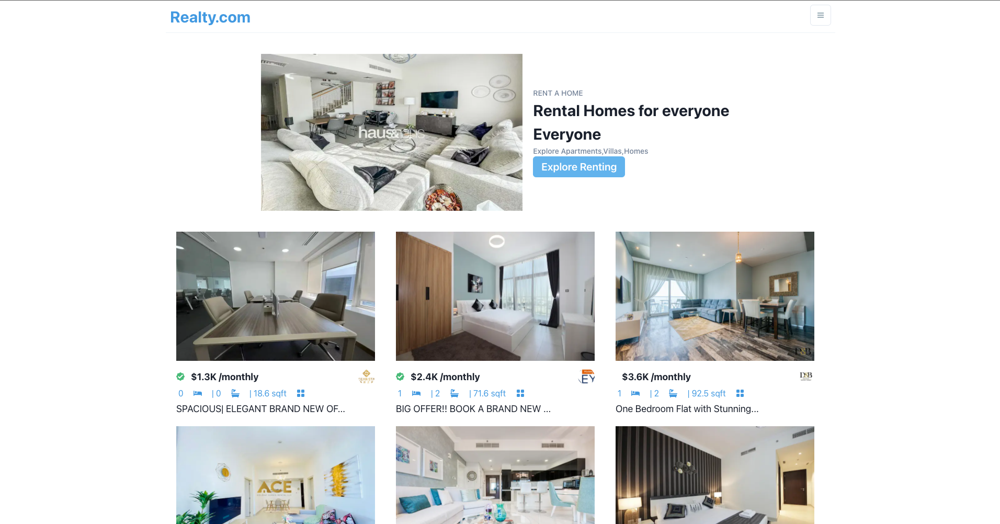

# Real Estate Web App

A brief description of what this project does and who it's for

## About The Project
The  realestate  system  provides  functionality  for  buyers,  allowing them to search  for houses, villas, plots by  features.
## Built Using
[Next.js](https://nextjs.org/)

[React.js](https://reactjs.org/)

[Chakra UI](https://chakra-ui.com/guides/with-nextjs)

[Axios](https://axios-http.com/)

[Rapid Api](https://rapidapi.com/)
## Features

- Advanced search using various filters
- Simple And Interactive UI
- Image gallery and description of each property
- User-Friendly Navigation Menus

## Screenshots

